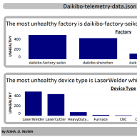
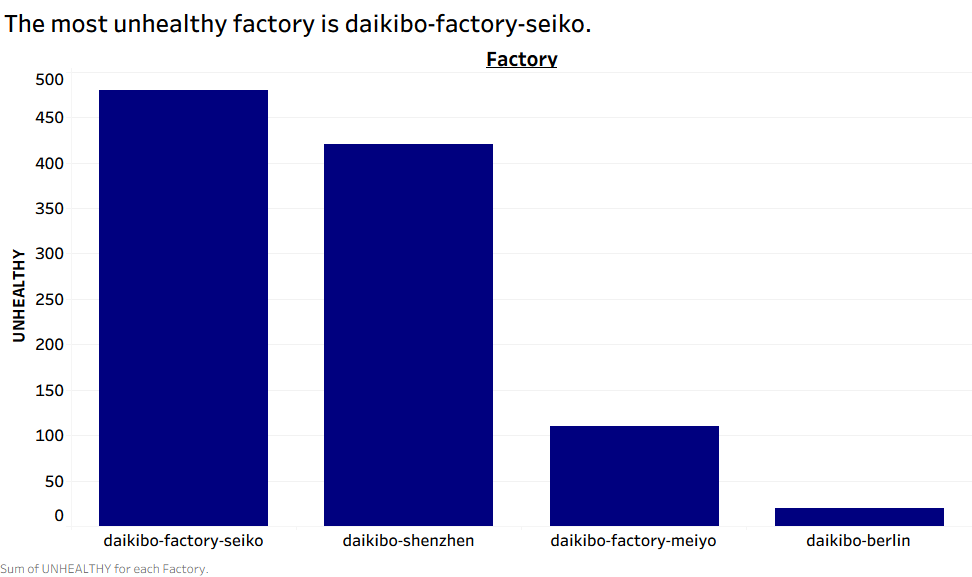
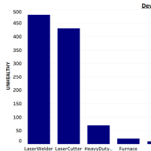

# Deloitte Technology Job Simulation — Forage

**By Aisha O. Inuwa**

This repository showcases my work from Deloitte's Technology job simulation on [Forage](https://www.theforage.com/), completed as part of my data analytics skill-building. The simulation involved two hands-on tasks for a fictional manufacturing client, **Daikibo Manufacturing**, covering data visualization and forensic data analysis.

🏅 *Certificate of completion available on request / linked below.*

---

## 📊 Task One: Data Analysis — Telemetry Dashboard (Tableau)

**Goal:** Analyze IoT telemetry data from Daikibo's factory floor devices and build a dashboard to help the client understand equipment health and downtime patterns.

### The Data
The dataset (`data/daikibo-telemetry-data_json.zip`) contains time-series telemetry readings from factory-floor IoT devices (CNC machines, laser welders, laser cutters, heavy-duty equipment, furnaces, and more) across Daikibo's factories in Japan and beyond. Each record includes:

- **Device info:** Device ID, Device Type
- **Location:** Country, City, Area, Factory, Section
- **Reading:** Timestamp, Status (healthy / unhealthy), Temperature

### What I Built
Using **Tableau**, I built an interactive dashboard (`tableau/daikibo-telemetry-dashboard.twbx`) with two supporting views:

| View | Purpose |
|---|---|
| **Down Time per Factory** | Compares the number of unhealthy device readings across each Daikibo factory to surface which sites have the most reliability issues |
| **Down Time per Device Type** | Breaks down unhealthy readings by device type (e.g. Laser Welder, Laser Cutter, CNC) to identify which equipment types fail most often |

### Key Findings
- 🏭 **Daikibo-Factory-Seiko** recorded the highest number of unhealthy device readings among all factories.
- ⚙️ **Laser Welders** were the most frequently unhealthy device type, ahead of Laser Cutters, Heavy Duty equipment, Furnaces, and CNC machines.

These findings would help Daikibo's operations team prioritize maintenance schedules and investigate recurring equipment failures at the affected sites.

### Dashboard Preview



<table>
<tr>
<td></td>
<td></td>
</tr>
<tr>
<td align="center"><em>Down Time per Factory</em></td>
<td align="center"><em>Down Time per Device Type</em></td>
</tr>
</table>

> 💡 To explore the dashboard interactively, download `tableau/daikibo-telemetry-dashboard.twbx` and open it in [Tableau Desktop](https://www.tableau.com/products/desktop) or [Tableau Public](https://public.tableau.com/) (free).

### Skills Applied
- Connecting Tableau to a JSON data source
- Building calculated fields (e.g. flagging "unhealthy" status counts)
- Designing comparative bar charts for categorical breakdowns
- Assembling multiple worksheets into a single dashboard view

---

## ⚖️ Task Two: Forensic Technology — Pay Equality Analysis (Excel)

**Goal:** Support an internal investigation into potential unfair pay practices at Daikibo by classifying pay equality scores across factories and job roles in Excel.

### The Data
The workbook (**[view the full table directly on GitHub →](Task_5_Equality_Table_by_AISHA_O_INUWA.xlsx)**, opens an in-browser preview — no download needed) contains an **Equality Score** for every Job Role at each of Daikibo's four sites — **Daikibo Factory Meiyo, Daikibo Factory Seiko, Daikibo Berlin, and Daikibo Shenzhen** — covering 37 role/factory combinations from C-Level down to Machine Operator. The Equality Score measures how far a role's pay deviates from a fair benchmark (positive or negative).

### What I Did
I added an **Equality Class** column and used a nested `IF` formula to automatically classify every row based on the size of its Equality Score, regardless of sign:

```excel
=IF(ABS(C2)<=10,"Fair",IF(ABS(C2)>20,"Highly Discriminative","Unfair"))
```

| Condition | Classification |
|---|---|
| `\|Equality Score\|` ≤ 10 | **Fair** |
| 10 < `\|Equality Score\|` ≤ 20 | **Unfair** |
| `\|Equality Score\|` > 20 | **Highly Discriminative** |

Using `ABS()` meant the classification caught discrimination in *either* direction (over- or under-paying relative to the benchmark) rather than only flagging negative scores.

### Key Findings
Across all 37 role/factory combinations:

| Equality Class | Count |
|---|---|
| Fair | 19 |
| Unfair | 11 |
| Highly Discriminative | 7 |

- 🚩 **Daikibo Factory Meiyo** had the most severe issues — 3 roles rated *Highly Discriminative*, including **C-Level (-25)** and **VP (-26)**, its two most senior positions.
- 🚩 **Daikibo Factory Seiko** also had 3 *Highly Discriminative* roles, concentrated in management (Sr. Manager, Manager, Jr. Manager all at -21 to -24).
- ✅ **Daikibo Berlin** came out best overall, with no *Highly Discriminative* roles at all — its worst classifications were mid-tier "Unfair" management roles.
- 📉 A pattern emerged across every factory: **senior and management roles (C-Level, VP, Director, Manager tiers) were consistently the least fair**, while engineering and operational roles were mostly **Fair**.

This kind of automated classification let the investigation move straight from raw scores to a prioritized list of which factories and role levels need the closest review — rather than reading 37 rows of numbers manually.

### Skills Applied
- Nested `IF` formulas for multi-tier conditional classification
- Using `ABS()` to catch deviations in both directions
- Structuring data for investigative / forensic analysis
- Drawing data-backed conclusions (by factory and by role level) for a non-technical audience

---

## 🛠️ Tools Used
- **Tableau** (Desktop) — data visualization and dashboard design
- **Microsoft Excel** — data classification and forensic analysis
- **JSON** — raw telemetry data format

## 📁 Repository Structure
```
├── README.md
├── tableau/
│   └── daikibo-telemetry-dashboard.twbx      # Full interactive Tableau workbook
├── data/
│   ├── daikibo-telemetry-data_json.zip        # Raw telemetry dataset (Task One)
│   └── Task_5_Equality_Table_by_AISHA_O_INUWA.xlsx   # Pay equality workbook (Task Two)
└── images/
    ├── dashboard-overview.png                 # Dashboard screenshot
    ├── downtime-per-factory.png
    └── downtime-per-device-type.png
```

## 🎓 About This Simulation
This project was completed through [Forage's](https://www.theforage.com/) virtual job simulation program, which offers realistic, self-paced tasks modeled on real work at partner companies — in this case, Deloitte's Technology practice. It gave me hands-on practice with the kind of data analysis and forensic technology work an analyst does on client engagements.

---

*Feel free to explore the dashboard file or reach out if you'd like to discuss the approach!*
